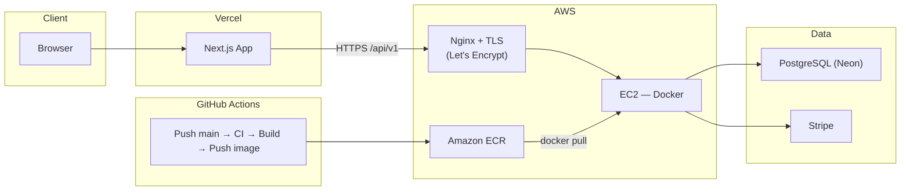
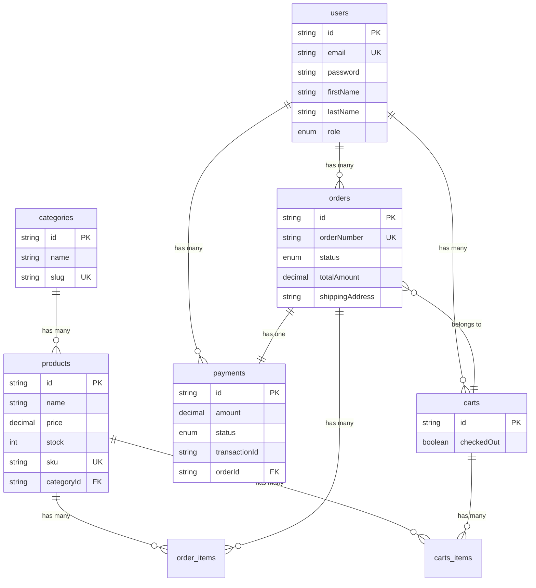

<div align="center">

# NestJS + Next.js E‑Commerce

Full‑stack e‑commerce platform with a **Next.js** storefront, **NestJS** REST API, **PostgreSQL** via **Prisma**, **Stripe** payments, and **JWT** authentication — containerized with **Docker**, deployed on **Vercel** + **AWS EC2**, with **GitHub Actions** CI/CD.

[](https://github.com/duylinh1510/next-nest-ecommerce)
[](https://next-nest-ecommerce-lovat.vercel.app)
[](https://ecommercenestapi.duckdns.org/api/docs)

[](https://nextjs.org/)
[](https://nestjs.com/)
[](https://www.typescriptlang.org/)
[](https://www.postgresql.org/)
[](https://www.prisma.io/)
[](https://www.docker.com/)
[](https://stripe.com/)

</div>

---

## Overview

| Layer | Stack |
| --- | --- |
| **Frontend** | Next.js 16 (App Router), React 19, Redux Toolkit + Persist, Axios, Stripe Elements, SCSS |
| **Backend** | NestJS 11, Prisma ORM, Passport JWT, Stripe API, Swagger |
| **Database** | PostgreSQL ([Neon](https://neon.tech/) cloud) |
| **Hosting** | Frontend → **Vercel** · API → **AWS EC2** behind **Nginx** + **Let’s Encrypt** (Certbot) |
| **Containers** | Docker images pushed to **AWS ECR** |
| **CI/CD** | **GitHub Actions** — lint, test, build, push ECR, SSH deploy to EC2 |

---

## Live Demo

| Resource | URL |
| --- | --- |
| **Frontend** | [next-nest-ecommerce-lovat.vercel.app](https://next-nest-ecommerce-lovat.vercel.app) |
| **Backend API** (base path) | [ecommercenestapi.duckdns.org/api/v1](https://ecommercenestapi.duckdns.org/api/v1) |
| **Swagger UI** | [ecommercenestapi.duckdns.org/api/docs](https://ecommercenestapi.duckdns.org/api/docs) |

---

## Architecture



**ASCII (high level)**

```
┌─────────────────┐     HTTPS       ┌──────────────────────────────┐
│  Next.js        │ ──────────────► │  Nginx (SSL) → NestJS :PORT    │
│  (Vercel)       │    /api/v1      │  Docker on AWS EC2             │
└─────────────────┘                 └───────────────┬────────────────┘
                                                    │
                                                    │ Prisma / TCP
                                                    ▼
                                        ┌───────────────────────┐
                                        │  PostgreSQL (Neon)      │
                                        └───────────────────────┘
```

---

## Features

- **Catalog** — Browse, search, filter by category, pagination  
- **Cart** — Guest-friendly persisted cart; merge with server cart at checkout  
- **Authentication** — Register / login; JWT access + refresh; Axios interceptor refresh on `401`  
- **Checkout** — Multi-step flow (shipping → payment → confirmation); Stripe Payment Element & 3D Secure  
- **Orders** — History, filters, detail, cancel pending orders, resume unpaid checkout  
- **Admin API** — CRUD for products, categories, orders, users (ROLE-based); storefront admin UI evolving  
- **API docs** — OpenAPI/Swagger at `/api/docs`

---

## Getting Started (Local Development)

### Prerequisites

- **Node.js** ≥ 18 (CI uses **22.x** for the API)
- **PostgreSQL** (local or Neon connection string)
- **Stripe** test keys ([Dashboard](https://dashboard.stripe.com/test/apikeys))

### 1. Clone the repository

```bash
git clone https://github.com/duylinh1510/next-nest-ecommerce.git
cd next-nest-ecommerce
```

### 2. Install dependencies

```bash
cd api && npm ci && cd ..
cd front && npm ci && cd ..
```

*(You can use **Bun** on the frontend if you prefer — see [front/README.md](./front/README.md).)*

### 3. Environment variables

Copy the example files and adjust values:

```bash
cp api/.env.example api/.env
cp front/.env.example front/.env.local
```

See **[Environment variables](#environment-variables)** below for descriptions.

### 4. Database (Prisma)

```bash
cd api
npx prisma generate
npx prisma db push
```

### 5. Run apps

```bash
# Terminal 1 — API (default port often 3001 locally)
cd api && npm run dev

# Terminal 2 — Frontend
cd front && npm run dev
```

| Service | Local URL |
| --- | --- |
| Frontend | [http://localhost:3000](http://localhost:3000) |
| Backend API | [http://localhost:3001/api/v1](http://localhost:3001/api/v1) *(if `PORT=3001`)* |
| Swagger | [http://localhost:3001/api/docs](http://localhost:3001/api/docs) |

---

## Environment Variables

Example templates live in:

- [`api/.env.example`](./api/.env.example)
- [`front/.env.example`](./front/.env.example)

### Backend (`api/.env`)

| Variable | Description |
| --- | --- |
| `DATABASE_URL` | PostgreSQL connection string (Neon or local) |
| `PORT` | HTTP port inside the container/host binding |
| `ALLOWED_ORIGINS` | Comma-separated browser origins for CORS (e.g. `http://localhost:3000`, production Vercel URL) |
| `JWT_SECRET` | Secret for signing access tokens |
| `JWT_REFRESH_SECRET` | Secret for signing refresh tokens |
| `JWT_EXPIRES_IN` | Access token TTL hint (see Nest JWT module config) |
| `JWT_REFRESH_EXPIRES_IN` | Used in deployment secrets alongside refresh flow |
| `STRIPE_SECRET_KEY` | Stripe **secret** key (`sk_test_…` / `sk_live_…`) |

Optional granular DB vars (`DATABASE_USER`, etc.) appear in production Secrets Manager payloads — Prisma primarily needs `DATABASE_URL`.

### Frontend (`front/.env.local`)

| Variable | Description |
| --- | --- |
| `NEXT_PUBLIC_API_URL` | Public API base **including** `/api/v1`, e.g. `http://localhost:3001/api/v1` |
| `NEXT_PUBLIC_STRIPE_PUBLISHABLE_KEY` | Stripe **publishable** key (`pk_test_…` / `pk_live_…`) |

---

## CI/CD Pipeline

Workflow: [`.github/workflows/api-ci-cd.yml`](./.github/workflows/api-ci-cd.yml)

**Triggers:** push to `main` (and manual `workflow_dispatch`).

| Stage | What runs |
| --- | --- |
| **CI** | Checkout → Node **22.19.0** → `npm ci` in `./api` → `prisma generate` → ESLint (`lint:ci`) → tests → `npm audit --audit-level=high` |
| **Deploy** | AWS OIDC login → **ECR** login → `docker build ./api` → tag & **push** `latest` → **SSH** to EC2 → pull image → load env from **AWS Secrets Manager** (`nestjs-prod-secrets`) → `docker run` with published port |

Secrets expected in GitHub: `AWS_OIDC_ROLE_ARN`, `AWS_REGION`, `ECR_REPOSITORY`, `EC2_HOST`, `EC2_USER`, `EC2_KEY`.

---

## Deployment Architecture

| Component | Role |
| --- | --- |
| **Vercel** | Hosts the Next.js build; sets `NEXT_PUBLIC_*` env vars at build time |
| **AWS EC2** | Runs the NestJS container; exposes app port mapped from Secrets Manager `PORT` |
| **Nginx** | Reverse proxy, TLS termination with **Certbot** (Let’s Encrypt); forwards to the Docker-published port |
| **AWS ECR** | Stores versioned Docker images produced by Actions |
| **Neon** | Managed PostgreSQL; `DATABASE_URL` injected at runtime on EC2 |
| **Stripe** | Payment intents / webhooks configured in Stripe Dashboard (ensure webhook URL & secrets match your deployment) |

Production checklist highlights:

- CORS `ALLOWED_ORIGINS` must include your **Vercel** URL(s).  
- Frontend `NEXT_PUBLIC_API_URL` must match your **HTTPS** API URL (avoid mixed content).  
- Rotate JWT and Stripe keys independently of image builds via Secrets Manager / Vercel env.

---

## Database Schema



---

## Project Structure

```
next-nest-ecommerce/
├── .github/workflows/     # GitHub Actions (API CI/CD → ECR → EC2)
├── api/                   # NestJS backend + Prisma
│   ├── prisma/
│   └── src/modules/       # Auth, Products, Cart, Orders, Payments, Users, …
├── front/                 # Next.js frontend (App Router)
│   ├── app/
│   ├── components/modules/
│   ├── services/api/
│   └── store/
├── README.md
├── api/.env.example
└── front/.env.example
```

For deeper docs per package, see [api/README.md](./api/README.md) and [front/README.md](./front/README.md).

---

## License

This project is released under the **MIT License** — free to use, modify, and distribute with attribution.

---

<div align="center">

**Built as a portfolio full‑stack reference · [Star on GitHub](https://github.com/duylinh1510/next-nest-ecommerce) if it helps your learning.**

</div>
